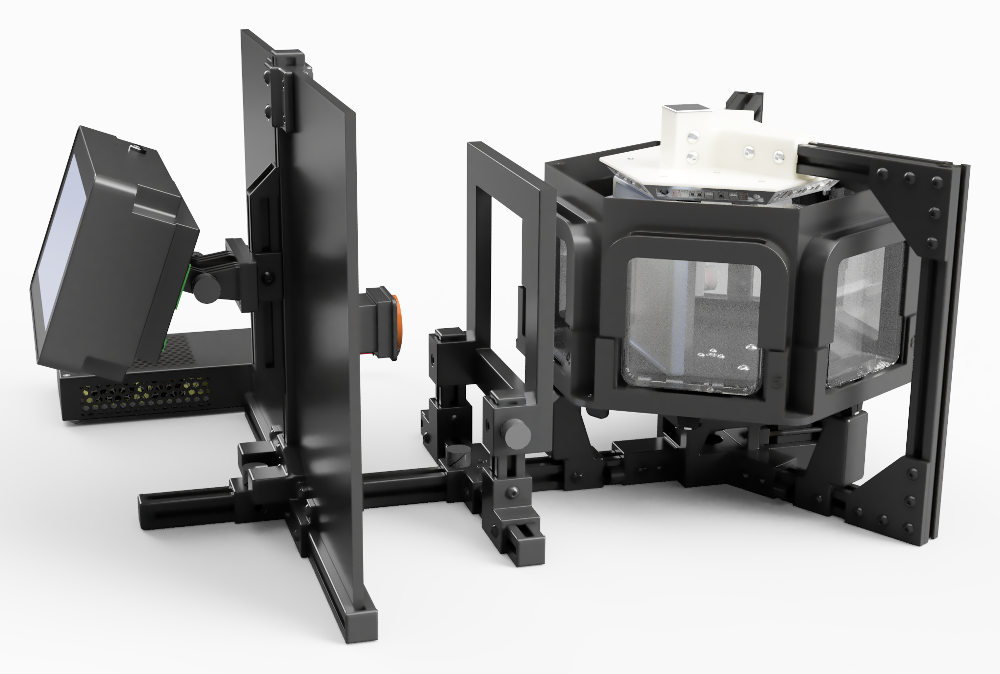

# Seedling Imager — Hardware Design Files

Open-source hardware for an automated, six-plate time-lapse seedling imaging robot.
This folder contains the mechanical CAD files, controller electronics (KiCad), bill of
materials, and licensing for the imager; the Raspberry Pi controller and
image-acquisition/registration software live in the root of this repository.

## Overview

The instrument is a rotating hexagonal carousel that holds up to six Petri plates and
presents each in turn to a fixed high-resolution camera. It is controlled by a
Raspberry Pi with a stepper motor and optical/magnetic position sensors, so every plate
returns to the same imaging position on each cycle. Plates are illuminated with both
transmitted and reflected 940 nm infrared light, allowing seedlings to be grown and
imaged either in the light or in complete darkness (etiolated), typically at 1–2 hour
intervals over 5–7 days. The system captures 16-bit grayscale TIFF images and
automatically aligns successive frames of each plate by phase cross-correlation
(frame-to-frame registration to ~2 pixels in current data).

The design was inspired by the open-source SPIRO Petri-plate imaging robot
(Ohlsson et al., 2024, *The Plant Journal* 118:584–600) and extends it with greater
plate capacity, dual transmitted + reflected IR illumination, and improved registration
reproducibility for quantitative time-lapse growth analysis.

## Contents

| Path | Description |
|------|-------------|
| `seedling imager_full assembly.step.zip` | Complete assembly in neutral STEP format (zipped; unzip before opening). Opens in any CAD package (FreeCAD, SolidWorks, Onshape, etc.). |
| Fusion archive `seedling imager_full assembly.f3z` | Native Autodesk Fusion archive of the complete assembly (127 MB, too large for the repository). Download from the **[latest GitHub Release](https://github.com/sybednar/seedling-imager-controller-display2/releases/latest)** and open in Fusion. |
| `CAD Files/` | Individual part and sub-assembly STEP files, organized by subsystem (below), plus `bill_of_materials.md`. |
| `Electronics/` | KiCad 10 schematic and PCB design files for the controller boards and hall sensor board (below). |
| `LICENSE-CERN-OHL-S-v2.txt` | Hardware license (see Licensing). |
| `NOTICE.txt` | Required CERN-OHL-S copyright/license notice. |

### CAD Files/ (STEP format, by subsystem)

| Folder | Contents |
|--------|----------|
| `Drive Base and Frame/` | Base plate, top plate, motor tensioning plate |
| `Carousel Assembly/` | Six-plate carousel with dual-bearing belt drive, carousel support bracket, adjustable bearing arms (including the optical sensor mount and the hall sensor arm), acrylic plate diffuser, the dual bearing belt drive motor base block, and the magnet and optical carousel position sensor triggers |
| `Rear Illuminator/` | Rear IR/illumination support hub |
| `Camera and Controller Mount/` | Display/camera rail light screen mounting hub assembly; Picamera mount with CSI-to-HDMI board (includes the camera housing, IR long-pass filter holder and rail corner bracket) |
| `Controller Enclosure/` | Display/touchscreen controller enclosure assembly (hinge, touchscreen compartment, RPi compartment, rear panel) |
| `Controller Subassembly/` | 3D models of the custom controller boards (Seedling Imager board_1 and board_2) |
| `Miscellaneous Hardware/` | 2020 T-slot end cap with cover, 2020 T-slot cover wire guide, 2020 8 mm cable guide, 100 mm × 15 mm square Petri dish magnetic fastener (8 mm magnet), M5 thumb screws (15 mm and 25 mm), Meanwell LRS-100-12 power supply enclosure, corner bracket, and fabrication jigs (acrylic diffuser hole-drilling jig, spindle heat-set insert installation jig) |

Standard off-the-shelf hardware (fasteners, 2020 aluminum extrusion, stepper motor, etc.)
is not included as CAD files — see `CAD Files/bill_of_materials.md` for part numbers.

### Electronics/ (KiCad 10)

| Folder | Description |
|--------|-------------|
| `Seedling Imager board_1/` | Main controller board (TMC2209 stepper driver, LED and sensor interfaces). Includes the `TSW_103_07_L_S` library (symbol, footprint and 3D model for the 0.1" pitch header). |
| `Seedling Imager board_2/` | Auxiliary MOSFET board for LED illumination control. |
| `Seedling Imager hall sensor board/` | A3144 hall sensor board mounted in the adjustable bearing arm for magnetic carousel position sensing. |

Each folder holds the `.kicad_pro`, `.kicad_sch` and `.kicad_pcb` files; open the
`.kicad_pro` in KiCad 10 or later. Schematic symbols and PCB footprints are embedded in
the files, so the boards open without extra libraries. Some PCB files reference 3D
models by absolute path on the author's machine; these only affect the 3D viewer and can
be re-pointed in *PCB Editor ▸ Preferences ▸ Configure Paths* or by editing footprint
properties.

## Opening the design files

- **STEP (.step):** Unzip `seedling imager_full assembly.step.zip`, then open the `.step`
  in any CAD program. STEP preserves exact solid geometry and is the recommended
  starting point for reuse or modification outside Fusion. The individual `.step` files
  in `CAD Files/` can be opened directly.
- **Fusion archive (.f3z):** Download it from the latest GitHub Release, then in Autodesk Fusion use *File ▸ Open* and select the `.f3z`,
  or upload it to your Fusion data panel. This is the fully editable source design
  (Fusion is free for personal/hobbyist use).

## Bill of materials

See `CAD Files/bill_of_materials.md`, grouped by category (structural and motion
components, electronics, power, motor, lights, wiring, hardware, ArUco markers, 2020
extrusion cut list, camera housing hardware, and controller board connectors).

## Notes

- An alternate camera/lens configuration (Arducam 20 MP monochrome + Computar M0814-MP2
  C-mount lens) was evaluated but has not yet been built or tested. Its CAD files are not
  included; the Picamera system above is the one running production experiments.
- The camera housing/mount, the IR long-pass filter holder (for the 37 mm 850 nm filter) and the
  mounting rail corner bracket are modeled as components of
  `Camera and Controller Mount/picamera mount_with csi to hdmi board.step` (and of the full
  assembly) rather than as separate files.

## Build and operation

Controller setup, camera configuration, and operation: see the documentation in the
repository root (`README.md`, `Camera configuration_user guide`,
`Setting manual camera focus instructions`).

## Licensing

This project uses two licenses:

- **Hardware design files** (CAD, STEP, KiCad, BOM) in this folder are licensed under the
  **CERN Open Hardware Licence Version 2 — Strongly Reciprocal (CERN-OHL-S v2)**.
  See `LICENSE-CERN-OHL-S-v2.txt` and `NOTICE.txt`.
- **Software** (the Raspberry Pi controller and image-acquisition/registration code) in
  the repository root is licensed under the **MIT** license.
  See the `LICENSE` file at the repository root.

## Citation

If you use this hardware or software, please cite the archived release:

> Bednarek, S. Y., Yong, C. W. J., Hoey, E. A. and Murua, K. (2026). *seedling-imager-controller-display2: control and image-acquisition
> software and hardware design files for an open-source six-plate infrared seedling imaging
> robot* (v1.3.1) [Software and hardware design files]. Zenodo. https://doi.org/10.5281/zenodo.23143807
>
> The DOI above is for release v1.3.1. To cite all versions (always resolves to the latest
> release), use https://doi.org/10.5281/zenodo.20738657.

## Contact

Sebastian Y. Bednarek, University of Wisconsin–Madison — sybednar@wisc.edu
